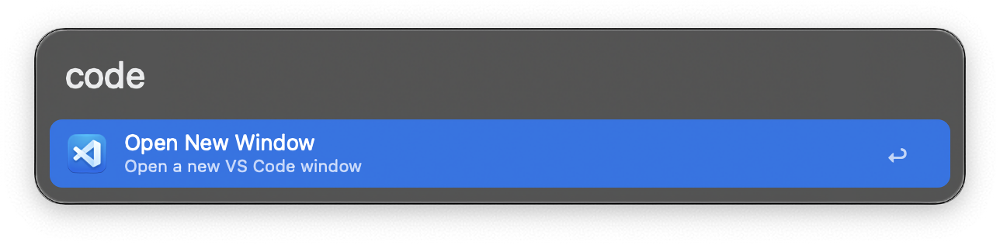

#  Visual Studio Code | Alfred Workflow

Control Visual Studio Code directly from Alfred. Jump to your recent projects in seconds, open any file or folder, search and manage extensions, and open new windows, all without taking your hands off the keyboard.

**Supports:** Visual Studio Code, VS Code Insiders, and VSCodium.

## Download

- Download it directly [from GitHub here](https://github.com/vanstrouble/vscode-alfred-workflow/releases/latest).

## Usage

### Recent projects and files (coder)

Browse your recently opened projects, workspaces, and files. Search by name to find what you need instantly.

- **Keyword:** `coder`
  - `↩` Open the selected project/file in VS Code
  - `⌘` `↩` Reveal in Finder
  - `⌥` `↩` View file in Alfred
  - `⌃` `↩` Remove from recent list
  - `⌃` `⇧` `↩` Remove all recent entries

#### Examples:

| Command         | Description                                                                 |
|-----------------|-----------------------------------------------------------------------------|
| `coder`          | Lists all recent projects and files.                                        |
| `coder myproject`| Filters results to match "myproject".                                       |

### Find and open files or folders (codef)

Search for any file or folder on your Mac and open it directly in VS Code.

- **Keyword:** `codef`
  - `↩` Open in VS Code
  - `⌘` `↩` Reveal in Finder
  - `⌥` `↩` View file in Alfred

### Open path in VS Code (codep)

Open any folder in VS Code by typing its path. If you don't provide a path, the current Finder window will be opened in VS Code automatically.

- **Keyword:** `codep [path]`

#### Examples:

| Command                                              | Description                                      |
|------------------------------------------------------|--------------------------------------------------|
| `codep`                                   | Opens the frontmost Finder window in VS Code.    |
| `codep ~/Projects/my-folder`                | Opens the specified folder in VS Code.           |

### New VS Code window (code)

Opens a fresh VS Code window, ready for a new project or quick edits.

- **Keyword:** `code`

### Search extensions (codes)

Search the VS Code Marketplace directly from Alfred. Find new extensions without opening your browser.

- **Keyword:** `codes [query]`
  - `↩` Install the extension
  - `⌘` `↩` View on VS Code Marketplace

#### Examples:

| Command                  | Description                                      |
|--------------------------|--------------------------------------------------|
| `codes python`     | Searches for Python-related extensions.          |
| `codes prettier`   | Searches for Prettier and formatting extensions. |

### Installed extensions (codex)

View all your installed extensions. Search by name to quickly find what you're looking for.

- **Keyword:** `codex`
  - `↩` Open extension in VS Code
  - `⌘` `↩` View on VS Code Marketplace
  - `⌃` `↩` Uninstall extension

## Customization

You can customize the keywords for each command directly in Alfred's workflow settings. Change them to whatever feels natural to you.

## Acknowledgments

This workflow was built upon the foundation of [Alex Chan's](https://github.com/alexchantastic/alfred-open-with-vscode-workflow) original work, with significant enhancements and new features added to create a more complete VS Code experience from Alfred.
